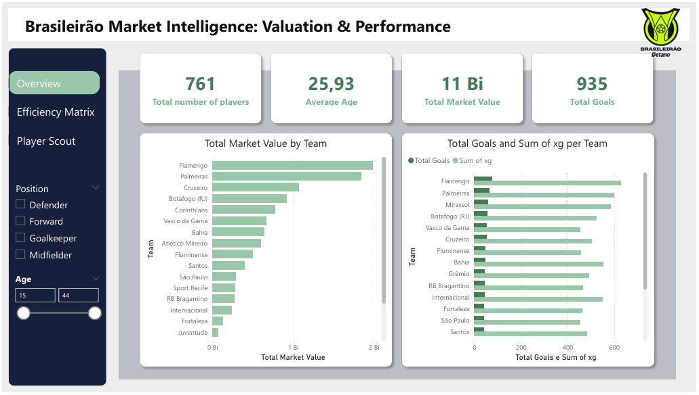

# PyScout BR - Football Analytics Pipeline ⚽

This project is a Python-based **ETL (Extract, Transform, Load)** solution designed to analyze player data from the Brazilian League (Brasileirão). It scrapes performance stats and market values from different sources, merging them via fuzzy logic to feed a **Business Intelligence** dashboard aimed at professional scouting.

## 📊 Dashboard Preview

Below are the visual insights generated by the Power BI dashboard:

### 1. Overview

### 2. Efficiency Matrix

### 3. Player Scout

## ⚙️ Key Features
* **Extraction:** Automated scraping scripts (`scraper_stats.py`, `scraper_values.py`) that gather data from multiple football statistics platforms using **BeautifulSoup**.
* **Transformation:**
    * Data cleaning and type conversion using **Pandas**.
    * Implements **Fuzzy Matching** (via `thefuzz` library) to reconcile player names across different data sources with varying naming conventions.
    * Structured organization using Object-Oriented Programming principles (`objects.py`).
* **Loading & Visualization:** Outputs a unified dataset optimized for **Power BI**, enabling visual analysis of player efficiency vs. market value.

## 🛠️ Technologies & Skills
* **Language:** Python 3.x
* **Libraries:** Pandas, BeautifulSoup, TheFuzz, Requests.
* **Visualization:** Power BI (DAX, Data Modeling).
* **Concepts:** Web Scraping, Data Engineering, Fuzzy Logic, ETL Pipelines, Business Intelligence (BI).

## 📁 Project Structure
* `dashboard/`: Contains the Power BI solution (`.pbix`) and report snapshots.
* `data/`: Directory for raw scraped logs and the final unified dataset (`dataset_bi`).
* `scraper_*.py`: Scripts responsible for the data extraction layer.
* `data_merger.py`: Core logic for merging and cleaning disparate datasets.
* `objects.py`: Python classes defining the data models.

## ⚙️ Setup Instructions

1. Clone the repository to your local machine.
2. Install the dependencies listed in requirements.txt using pip install -r requirements.txt.
3. Run the scrapers (scraper_stats.py and scraper_values.py) to extract the latest football data into the /data folder.
4. Execute data_merger.py to process and unify the datasets using fuzzy matching logic.
5. Open the Power BI dashboard located at dashboard/scout_bi.pbix to visualize the results.

## 📧 Contact
Nathan Chaia | [LinkedIn](https://www.linkedin.com/in/nathan-chaia-ba57773a2)
